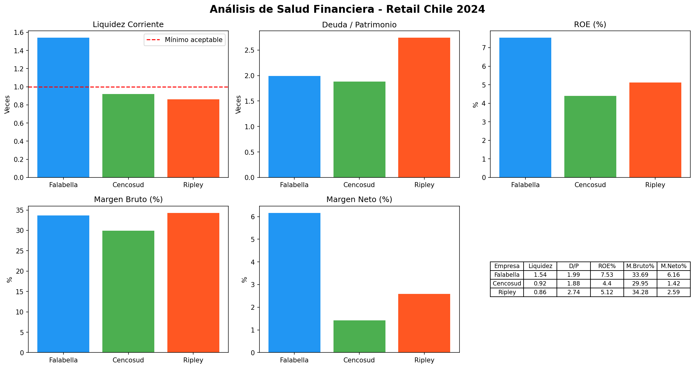
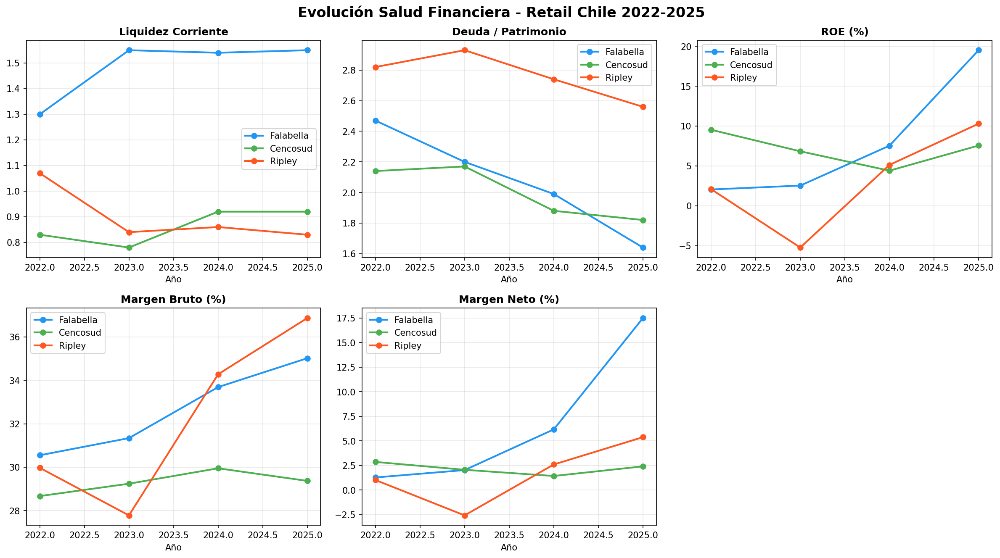

# Análisis de Salud Financiera - Retail Chile 2022-2025

## Contexto
Análisis comparativo de ratios financieros de las tres principales empresas 
del retail chileno listadas en bolsa: Falabella, Cencosud y Ripley.
El análisis simula el trabajo de un analista de riesgo crediticio evaluando 
la solidez financiera del sector retail para una institución bancaria.

## Objetivo
Identificar tendencias de salud financiera entre 2022 y 2025, detectar señales 
de alerta y determinar qué empresa presenta el perfil de riesgo más favorable 
desde una perspectiva crediticia.

## Datos
- **Fuente:** Comisión para el Mercado Financiero (CMF) - Chile
- **Período:** 2022, 2023, 2024 y 2025
- **Empresas:** Falabella S.A., Cencosud S.A., Ripley Corp S.A.
- **Estados financieros:** Situación financiera y resultados bajo norma IFRS

## Metodología
- Extracción y limpieza de datos con Python (pandas)
- Cálculo de 5 ratios financieros clave por empresa y año
- Visualización comparativa y de tendencias con matplotlib

## Ratios Analizados
- **Liquidez Corriente:** capacidad de cubrir obligaciones de corto plazo
- **Deuda/Patrimonio:** nivel de apalancamiento financiero
- **ROE:** retorno sobre patrimonio de los accionistas
- **Margen Bruto:** eficiencia en costos de producto
- **Margen Neto:** capacidad de convertir ventas en utilidad final

## Hallazgos Principales
- **Falabella** lidera el sector en todos los ratios, con un quiebre estructural 
  en rentabilidad: ROE pasó de 2.04% (2022) a 19.51% (2025), combinado con un 
  proceso sostenido de desapalancamiento.
- **Ripley** muestra la mayor volatilidad — pérdidas reales en 2023 (ROE -5.24%) 
  y fuerte recuperación en 2025. Su margen bruto es el mejor del sector pero su 
  alta deuda erosiona la utilidad final.
- **Cencosud** presenta el perfil de mayor riesgo estructural — liquidez 
  consistentemente bajo 1.0 durante 4 años y el margen neto más bajo del sector.

## Conclusión de Riesgo Crediticio
1° Falabella — perfil más sólido y en mejora sostenida  
2° Ripley — recuperación notable pero deuda alta  
3° Cencosud — señales de alerta estructurales en liquidez y rentabilidad

## Herramientas
- Python (pandas, matplotlib)
- Google Colab
- Datos públicos CMF Chile

## Visualizaciones

